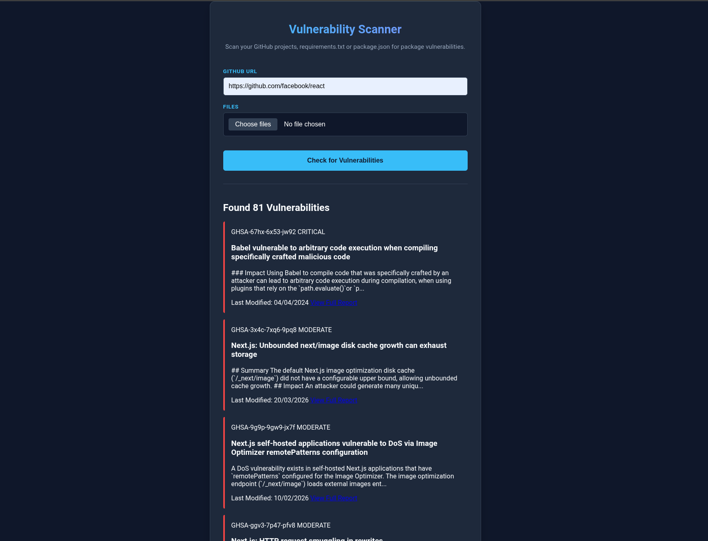

# vuln-check

A lightweight client-side tool that scans dependency files and GitHub repos for known vulnerabilities using the OSV.dev database.

## Features

- Upload requirements.txt or package.json
- Scan GitHub repos via URL
- Uses OSV.dev for vulnerability data
- Fully client-side
- Easy-to-use
- No API keys required (public repos only, will probably add private repo support later.)

## How It Works

1. Upload one or more dependency files and/or paste in a GitHub repo URL
2. The app automatically extracts all dependencies
3. Queries the OSV API for known package vulnerabilities
4. Displays results in a clean, easy-to-read format

- Results include:
    - vulnerability ID
    - severity
    - summary
    - more details
    - link to OSV entry

## Screenshot

## Usage

**Option 1**

Use via GitHub Pages link: (https://satsumasegment.github.io/vuln-check/)[https://satsumasegment.github.io/vuln-check/]

**Option 2**

1. Clone the repo `git clone https://github.com/SatsumaSegment/vuln-check`
2. Either:
    - Open `index.html`
    - OR Use live server, e.g. `python -m http.server` then visit http://localhost:8000

## Limitations

- Only supports requirements.txt and package.json files (at the moment)
- Only supports public repos (for now)
- API rate limits apply

**GitHub API usage**

The main GitHub API allows 60 requests per hour per IP address

This app uses 2 requests per repo (1 to get repo details and find default branch and 1 to get the repo file tree)

The rate limit for GitHub RAW files is ~5000 requests per hour, this is called once per dependency file in the repo.

**OSV API usage**

The OSV API does not have rate limits. Response sizes for HTTP/1.1 are 32MiB (~33.5Mb). Responses for HTTP/2 are not limited.

_Note: API limits may change_

## Contributing

Feel free to open issues or submit pull requests.
Ideas, improvements, and bug fixes are welcome!

## License

MIT License

## Future Development

- Add more dependency filetypes 
- Add GitHub API Token compatibility for private repo scanning
- Add filtering (by severity)
- Make UI better for large dependency trees (less scrolling)
- Add an "Export" feature 
- Increase efficiency
- Colour-code severity types
